## Table of Contents

1. [Enter the Matrix: An Introduction to Linear Algebra](#enter-the-matrix-an-introduction-to-linear-algebra)
2. [Overview](#overview)
3. [Goal of this project](#goal-of-this-project)
4. [Exercises and Topics](#exercises-and-topics)
5. [Getting Started](#getting-started)
6. [What is a Vector?](#1-what-is-a-vector)
    - [Simple Definition](#a-simple-definition)
    - [Everyday Example](#b-everyday-example)
    - [Mathematical Representation](#c-mathematical-representation)
    - [Visual Representation](#d-visual-representation)
    - [Uses in Algebra](#e-uses-in-algebra)
    - [Uses in Computer Science](#f-uses-in-computer-science)
    - [The Components of a Vector from Its Endpoints](#the-components-of-a-vector-from-its-endpoints)
    - [Calculating the Magnitude](#calculating-the-magnitude-mathbfv)
7. [What is a Matrix?](#2-what-is-a-matrix)
    - [Simple Definition](#a-simple-definition-1)
    - [Everyday Example](#b-everyday-example-1)
    - [Mathematical Representation](#c-mathematical-representation-1)
    - [Visual Representation](#d-visual-representation-1)
    - [Uses in Algebra](#e-uses-in-algebra-1)
    - [Uses in Computer Science](#f-uses-in-computer-science-1)
8. [Ex 00](#ex-00)
    - [Vector Addition and Subtraction](#vector-addition-and-subtraction)
    - [Scalar Multiplication](#scalar-multiplication)
    - [Matrix Operations: Addition and Subtraction](#matrix-operations-addition-and-subtraction)
9. [Ex 01](#ex-01)
    - [What's a Linear Combination?](#whats-a-linear-combination)
10. [Ex 02](#ex-02)
    - [Linear Interpolation](#linear-interpolation)
11. [Ex 03](#ex-03)
    - [The Dot Product](#the-dot-product)

---

# Enter the Matrix: An Introduction to Linear Algebra

Welcome to **Enter the Matrix**, a comprehensive educational project designed to introduce you to the fundamental concepts of linear algebra. This module covers theoretical foundations, practical coding exercises, and explores the rich connections between linear algebra and various fields such as computer science, physics, and data science.

## Overview

Linear algebra is a cornerstone of modern mathematics and its applications are vast, spanning areas such as:
- **Physics**: Mechanics, quantum mechanics, and relativity.
- **Computer Science**: Graphics, game development, and high-performance computing.
- **Data Science**: Machine learning, statistics, and big data analytics.

This project emphasizes practical learning through a series of exercises and challenges. It focuses on finite-dimensional vector spaces and their transformations, represented as matrices, with an emphasis on 2D and 3D spaces for better visualization.

## Goal of this project 

- **Structured Learning**: Gradually build your understanding from basic vector operations to advanced topics like matrix decomposition and projection matrices.
- **Hands-On Coding**: Implement fundamental operations (e.g., addition, scaling, and dot products) and explore their applications.
- **Cross-Disciplinary Insights**: Learn how linear algebra underpins graphics rendering, machine learning, and statistical models.

## Exercises and Topics

This project includes:
- Vector operations: addition, subtraction, scaling.
- Linear combinations, dot products, and norms.
- Matrix operations: multiplication, transposition, and inversion.
- Advanced topics: rank, projection matrices, and systems of linear equations.

## Getting Started

1. Familiarize yourself with the provided theoretical content.
2. Watch the **Essence of Linear Algebra** video series by 3blue1brown for a visual introduction.
3. Start coding! Implement the exercises as described in the documentation.

---

## 1. What is a Vector?

### a. Simple Definition
A **vector** is a way to represent both a **magnitude** (size) and a **direction**. Think of it as an arrow pointing from one place to another.

### b. Everyday Example
Imagine you're giving someone directions: "Walk 3 blocks north and 4 blocks east." This direction can be represented as a vector because it has both length (how far) and direction (where to).

### c. Mathematical Representation
In math, a vector is usually written as an ordered list of numbers. For example:
- **2D Vector**: $[x, y] \,\,i.e\; \, [3, 4]$
- **3D Vector**: $[x, y, z] \,\,i.e\, \,[1, 5, 2]$

These numbers represent the vector's components along each axis (like north/south and east/west).

### d. Visual Representation
- **2D Vector**: Picture a flat graph with an x-axis (horizontal) and y-axis (vertical). A vector $[3, 4]$ starts at the origin (0,0) and points to the position (3,4).

    

        
<b>Click to view 2D Vector Example</b>

        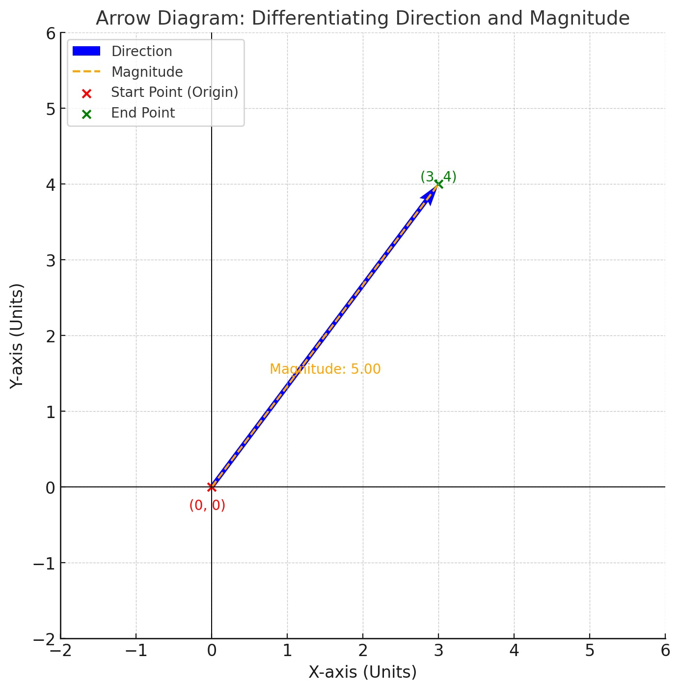
    

---

- **3D Vector**: Imagine adding a z-axis (depth) to the graph. A vector $[1, 5, 2]$ points into this three-dimensional space.

    

        
<b>Click to view 3D Vector Example</b>

        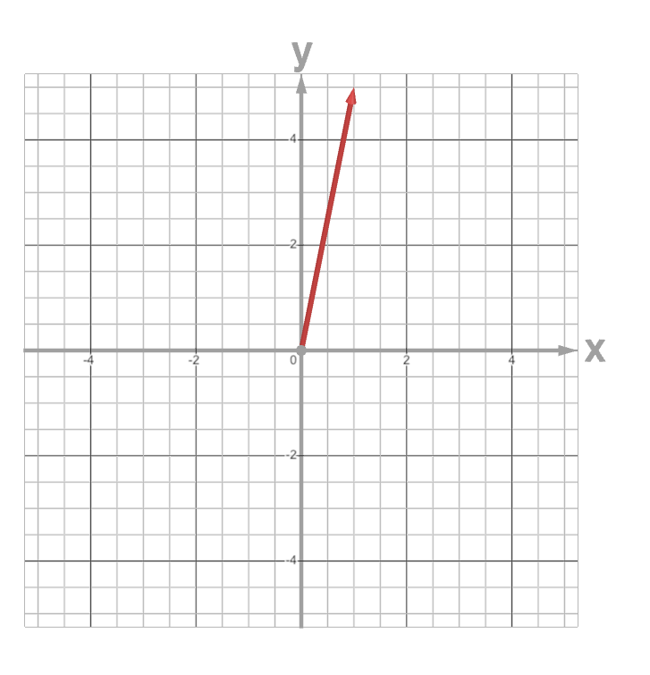
        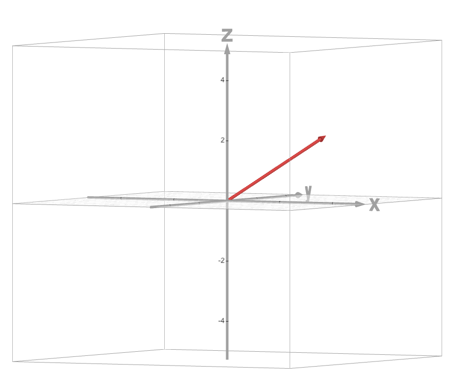
    

### e. Uses in Algebra
In algebra, vectors are used to solve systems of equations, represent points in space, and perform operations like addition and scalar multiplication (changing the size of the vector).

### f. Uses in Computer Science
Vectors are fundamental in computer graphics (representing positions and movements), machine learning (storing data as numerical lists), and physics simulations (modeling forces and velocities).

### The Components of a Vector from Its Endpoints

When you have a vector defined by two points 
$A(x_1, y_1)$  and $B(x_2, y_2)$, 
the most common way to find its components **(y-vertical-component and x-horizontal-component)** (in 2D) is to subtract the coordinates of \( A \) from the coordinates of \( B \). In other words:

$$
\overrightarrow{AB} = (\,x_2 - x_1, \; y_2 - y_1\,).
$$

- **(horizontal) X-component:** $x_2 - x_1$
- **(Vectical)Y-component:** $y_2 - y_1$

This pair of numbers tells you how far you move horizontally and vertically to go from \( A \) to \( B \).
 
1. If  $x_2 - x_1$ is **positive**, the vector moves to the **right**.  
2. If  $x_2 - x_1$ is **negative**, it moves to the **left**.  
3. If  $y_2 - y_1$ is **positive**, it moves **upward**.  
4. If  $y_2 - y_1$ is **negative**, it moves **downward**.

### Graphical Example

Consider points $A(1, 2)$ and $B(4, 6)$:

- **x-component:** $4 - 1 = 3$  
- **y-component:** $6 - 2 = 4$

The vector $\overrightarrow{AB}$ can be represented as $(3, 4)$.

    
<b>Click to view the graphical representation</b>

    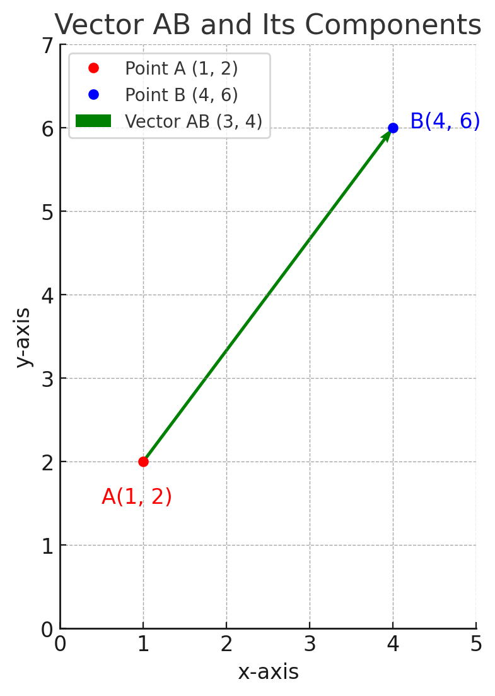
    

    In this diagram, the red point is A(1,2), the blue point is B(4,6), and the green arrow is the vector (3,4), highlighting its horizontal and vertical components.
    

---

### Calculating the Magnitude $||\mathbf{v}||$

#### a. Simple Definition
The **magnitude** of a vector measures its length or size. It tells you how long the vector is in space.

#### b. Everyday Example
Imagine walking from your home to a friend's house. The distance you walk represents the magnitude of the displacement vector between the two points.

#### c. Mathematical Representation
For a vector $\mathbf{v} = [x, y]$ in 2D or $\mathbf{v} = [x, y, z]$ in 3D, the **magnitude** $||\mathbf{v}||$ is calculated using the following formula:

- **2D Vector:**

$$
||\mathbf{v}|| = \sqrt{x^2 + y^2}
$$

- **3D Vector:**

$$
||\mathbf{v}|| = \sqrt{x^2 + y^2 + z^2}
$$

#### d. Example Calculation

- **2D Example:**
    
    Consider the vector $\mathbf{v} = [3, 4] $.
    
$$
||\mathbf{v}|| = \sqrt{3^2 + 4^2} = \sqrt{9 + 16} = \sqrt{25} = 5
$$

- **3D Example:**
    
    Consider the vector $\mathbf{u} = [1, 2, 2] $.
    
$$
||\mathbf{u}|| = \sqrt{1^2 + 2^2 + 2^2} = \sqrt{1 + 4 + 4} = \sqrt{9} = 3
$$

#### e. Visual Representation

    
<b>Click to view Vector Magnitude Examples</b>

<h5>2D Vector Magnitude:</h5>

    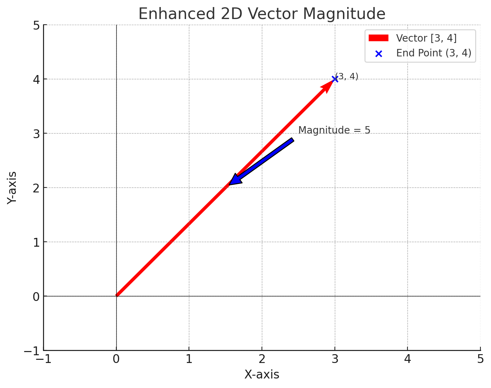

<i>The length of the arrow represents the magnitude of the vector.</i>

<h5>3D Vector Magnitude:</h5>

    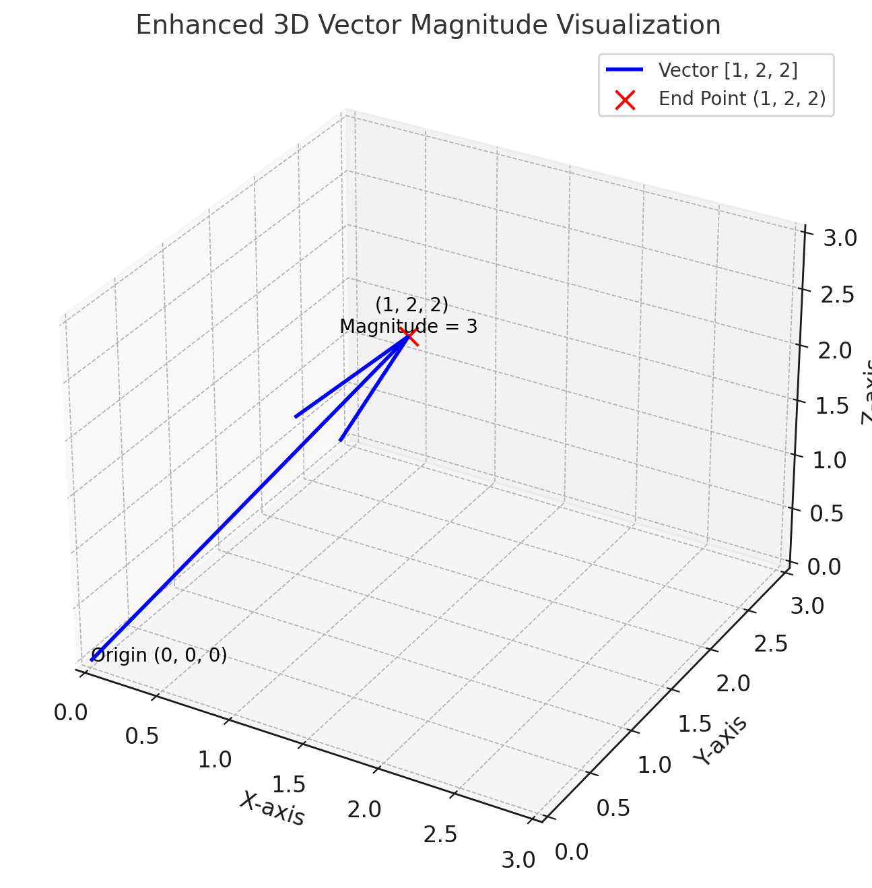

<i>The length of the arrow in three-dimensional space indicates the vector's magnitude.</i>

---

## 2. What is a Matrix?

### a. Simple Definition
A **matrix** is a rectangular array of numbers arranged in rows and columns. You can think of it as a spreadsheet with multiple rows and columns.

### b. Everyday Example
Imagine an Excel spreadsheet where each cell contains a number. This grid of numbers is similar to a matrix.

### c. Mathematical Representation
A matrix is written using brackets with rows and columns. For example, a 2x3 matrix (2 rows and 3 columns) looks like this:

$$
\begin{bmatrix}
1 & 2 & 3 \\
4 & 5 & 6 \\
\end{bmatrix}
$$

### d. Visual Representation
Think of a matrix as a table:

|   | Column 1 | Column 2 | Column 3 |
|---|:--------:|:--------:|:--------:|
| **Row 1** |    1     |     2    |     3    |
| **Row 2** |    4     |     5    |     6    |

### e. Uses in Algebra
In algebra, matrices are used to solve systems of equations, perform linear transformations (like rotating or scaling shapes), and represent data in a structured form.

### f. Uses in Computer Science
Matrices are essential in computer graphics (transforming images), machine learning (handling large datasets), network analysis, and solving complex algorithms efficiently.

---
# Ex 00

## Vector Addition and Subtraction

### Basic Operations

#### Vector Addition
To add two vectors, add their corresponding components:

$$
\begin{aligned}
\mathbf{u} &= [2, 3] \\
\mathbf{v} &= [4, 1] \\
\mathbf{u} + \mathbf{v} &= [2+4, 3+1] = [6, 4]
\end{aligned}
$$

#### Visual Representation

    
<b>Click to view Vector Addition Example</b>

    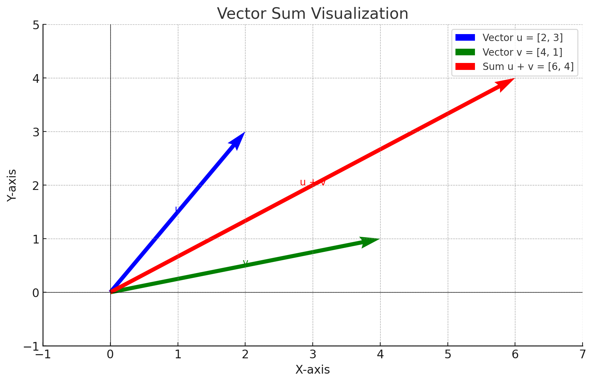

#### Vector Subtraction
To subtract vectors, subtract their corresponding components:

$$
\begin{aligned}
\mathbf{u} &= [5, 7] \\
\mathbf{v} &= [2, 3] \\
\mathbf{u} - \mathbf{v} &= [5-2, 7-3] = [3, 4]
\end{aligned}
$$

Here's another example with a negative vector:

$$
\begin{aligned}
\mathbf{u} &= [-2, 4] \\
\mathbf{v} &= [3, -1] \\
\mathbf{u} - \mathbf{v} &= [-2-3, 4-(-1)] = [-5, 5]
\end{aligned}
$$

#### Visual Representation

    
<b>Click to view Vector Subtraction Example</b>

    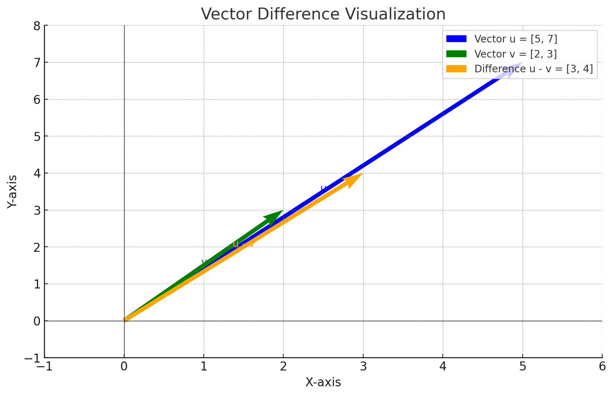

### Key Properties

- Addition is commutative: $\mathbf{u} + \mathbf{v} = \mathbf{v} + \mathbf{u}$
- Subtraction is not commutative: $\mathbf{u} - \mathbf{v} \neq \mathbf{v} - \mathbf{u}$
- Zero vector addition: $\mathbf{v} + [0,0] = \mathbf{v}$

## Scalar Multiplication

### Simple Definition
**Scalar Multiplication** is when you multiply a vector by a single number (scalar), affecting its magnitude but not its direction (unless negative).

### Mathematical Representation
For a scalar $a$ and vector $\mathbf{v}$:

$$
a\mathbf{v} = [ax_1, ax_2, ..., ax_n]
$$

### Example
Given vector $\mathbf{v} = [2, 3]$ and scalar $a = 4$:

$$
4 \times [2, 3] = [8, 12]
$$

### Visual Representation

    
<b>Click to view Scalar Multiplication Example</b>

    

        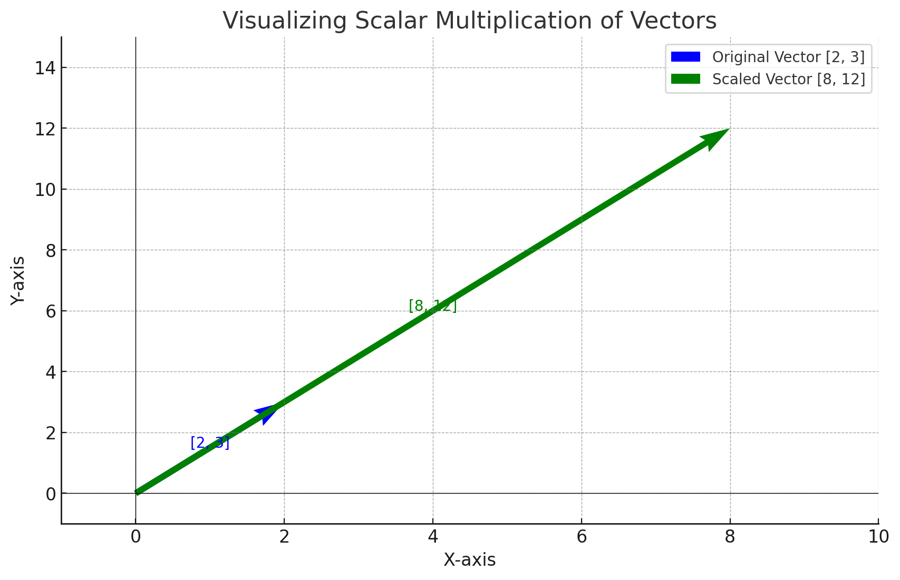
    

    <ul>
        <li>🔵 The blue arrow represents the original vector $[2,3]$.</li>
        <li>🟢 The green arrow represents the scaled vector $[8,12]$, obtained by multiplying the original vector by 4.</li>
    </ul>

## Matrix Operations: Addition and Subtraction

### Addition Example
Given two 2×2 matrices:

$$
A = \begin{bmatrix}
1 & 2 \\
3 & 4 \\
\end{bmatrix}, \quad
B = \begin{bmatrix}
5 & 6 \\
7 & 8 \\
\end{bmatrix}
$$

Add corresponding elements:

$$
A + B = \begin{bmatrix}
1+5 & 2+6 \\
3+7 & 4+8 \\
\end{bmatrix} = \begin{bmatrix}
6 & 8 \\
10 & 12 \\
\end{bmatrix}
$$

### Subtraction Example
Matrix subtraction can be expressed as: $A - B = A + (-1)⋅B$

Given two 2×2 matrices:

$$
A = \begin{bmatrix}
3 & 5 \\
7 & 9 \\
\end{bmatrix}, \quad
B = \begin{bmatrix}
1 & 2 \\
4 & 6 \\
\end{bmatrix}
$$

First, calculate $(-1)⋅B$:

$$
(-1)⋅B = \begin{bmatrix}
-1 & -2 \\
-4 & -6 \\
\end{bmatrix}
$$

Then add $A$ and $(-1)⋅B$:

$$
A - B = \begin{bmatrix}
3-1 & 5-2 \\
7-4 & 9-6 \\
\end{bmatrix} = \begin{bmatrix}
2 & 3 \\
3 & 3 \\
\end{bmatrix}
$$

### Key Properties

- Matrices must have the same dimensions.
- Operations are performed element by element.
- These operations form the basis for more complex matrix transformations.

-------------------------------------------------------------------------

# ex 01

## What's a Linear Combination?

A linear combination involves taking several vectors and scaling each one by a number (called a scalar), then adding them up. For instance:

To understand the linear combination, let's break it down step by step:

### Example

Given vectors and scalars:
- Vectors: $\mathbf{u_1} = [1, 0, 0]$, $\mathbf{u_2} = [0, 1, 0]$
- Scalars: $a = 2$, $b = 3$

### Calculation

1. **Scale each vector by its corresponding scalar:**

$$
a \times \mathbf{u_1} = 2 \times [1, 0, 0] = [2, 0, 0]
$$

$$
b \times \mathbf{u_2} = 3 \times [0, 1, 0] = [0, 3, 0]
$$

2. **Add the scaled vectors:**

$$
\text{Result} = [2, 0, 0] + [0, 3, 0] = [2, 3, 0]
$$

So, the linear combination of the vectors $\mathbf{u_1}$ and $\mathbf{u_2}$ with scalars $a$ and $b$ is:

$$
\text{Result} = (2 \times [1, 0, 0]) + (3 \times [0, 1, 0]) = [2, 0, 0] + [0, 3, 0] = [2, 3, 0]
$$

### Real-World Applications

Linear combinations are crucial in:
- **Computer Graphics**: Blending colors or positions
- **Physics**: Calculating forces or velocities
- **Economics**: Portfolio optimization
- **Signal Processing**: Combining waveforms

### Inputs of the Function

- A list of vectors (e.g., `u = [[1, 0, 0], [0, 1, 0], [0, 0, 1]]`).
- A list of scalars (e.g., `λ = [10, -2, 0.5]`).

### Output

- A single vector that is the result of applying the scalars to the corresponding vectors and summing them up.

### How the Function Works

- Multiply each vector by its corresponding scalar.
- Add the resulting scaled vectors together.

### Example

- Input vectors: `u = [[1, 0, 0], [0, 1, 0], [0, 0, 1]]`.
- Scalars: `λ = [10, -2, 0.5]`.
- Result:

$$
(10 \times [1, 0, 0]) + (-2 \times [0, 1, 0]) + (0.5 \times [0, 0, 1]) = [10, -2, 0.5]
$$

### Efficiency

- The problem states that the solution must have a complexity of $O(n)$, where $n$ is the total number of numbers in all the vectors combined.  This means your solution should process each coordinate exactly once.

### Constraints

- All vectors must have the same dimension.
- The number of scalars must match the number of vectors.
- Scalars and vector components should be real numbers.

# Ex 02

## Linear Interpolation

Linear interpolation (often abbreviated as "lerp") is a method of curve fitting using linear polynomials to construct new data points within the range of a discrete set of known data points.

### Definition

Linear interpolation connects two known points with a straight line and finds points along that line. The formula for linear interpolation between two points is:

$$
\text{lerp}(a, b, t) = a + t \times (b - a)
$$

Where:
- $a$ is the starting value
- $b$ is the ending value
- $t$ is the interpolation parameter (typically between 0 and 1)

### Example Calculation

If we want to find a point 30% of the way from 10 to 20:

$$
\text{lerp}(10, 20, 0.3) = 10 + 0.3 \times (20 - 10) = 10 + 0.3 \times 10 = 10 + 3 = 13
$$

### Visual Representation

    
<b>Click to view Linear Interpolation Example</b>

    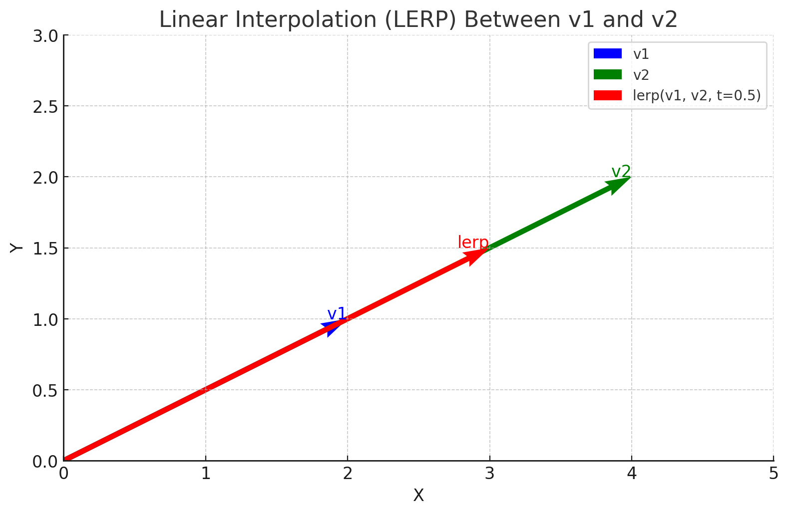
    
<i>The blue line represents linear interpolation between points A and B. Parameter t controls the position along this line.</i>

### Vector Interpolation

Linear interpolation works with vectors by applying the formula to each component:

For vectors $\mathbf{v_1} = [a_1, a_2, ..., a_n]$ and $\mathbf{v_2} = [b_1, b_2, ..., b_n]$:

$$
\text{lerp}(\mathbf{v_1}, \mathbf{v_2}, t) = [a_1 + t(b_1 - a_1), a_2 + t(b_2 - a_2), ..., a_n + t(b_n - a_n)]
$$

### Example with Vectors

If $\mathbf{v_1} = [1, 2, 3]$ and $\mathbf{v_2} = [4, 5, 6]$ with $t = 0.5$:

$$
\begin{aligned}
\text{lerp}(\mathbf{v_1}, \mathbf{v_2}, 0.5) &= [1 + 0.5(4-1), 2 + 0.5(5-2), 3 + 0.5(6-3)] \\
&= [1 + 0.5 \times 3, 2 + 0.5 \times 3, 3 + 0.5 \times 3] \\
&= [1 + 1.5, 2 + 1.5, 3 + 1.5] \\
&= [2.5, 3.5, 4.5]
\end{aligned}
$$

### Applications

- **Computer Graphics**: Smoothly transitioning between positions, colors, or rotations
- **Animation**: Creating in-between frames for smooth movement
- **Data Visualization**: Generating color gradients or smooth transitions
- **Finance**: Approximating values between known data points

### Implementation Considerations

- Parameter $t$ is not restricted to [0,1], but values in this range interpolate between the points
- When $t = 0$, the result equals the first point
- When $t = 1$, the result equals the second point
- The vectors must have the same dimension
- The operation has linear time complexity O(n), where n is the dimension of the vectors

# Ex 03

## The Dot Product

The dot product is a fundamental operation between two vectors that results in a scalar value. It's also called the scalar product or inner product.

### Definition

For two vectors $\mathbf{u} = [u_1, u_2, ..., u_n]$ and $\mathbf{v} = [v_1, v_2, ..., v_n]$, their dot product is:

$$
\mathbf{u} \cdot \mathbf{v} = u_1 \times v_1 + u_2 \times v_2 + ... + u_n \times v_n = \sum_{i=1}^{n} u_i v_i
$$

### Example Calculation

If $\mathbf{u} = [1, 2, 3]$ and $\mathbf{v} = [4, 5, 6]$:

$$
\mathbf{u} \cdot \mathbf{v} = 1 \times 4 + 2 \times 5 + 3 \times 6 = 4 + 10 + 18 = 32
$$

### Geometric Interpretation

The dot product has a geometric meaning:

$$
\mathbf{u} \cdot \mathbf{v} = ||\mathbf{u}|| \times ||\mathbf{v}|| \times \cos(\theta)
$$

Where:
- $||\mathbf{u}||$ and $||\mathbf{v}||$ are the magnitudes of the vectors
- $\theta$ is the angle between them

    
<b>Click to view Geometric Representation</b>

    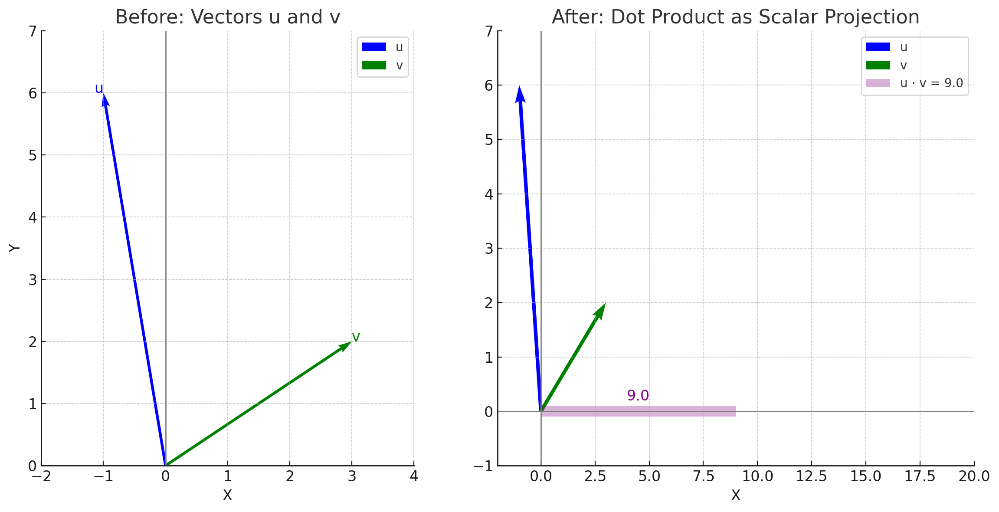

### Properties

- **Commutative**: $\mathbf{u} \cdot \mathbf{v} = \mathbf{v} \cdot \mathbf{u}$
- **Distributive**: $\mathbf{u} \cdot (\mathbf{v} + \mathbf{w}) = \mathbf{u} \cdot \mathbf{v} + \mathbf{u} \cdot \mathbf{w}$
- **Scalar Multiplication**: $(a\mathbf{u}) \cdot \mathbf{v} = a(\mathbf{u} \cdot \mathbf{v})$
- **Zero Vector**: If $\mathbf{u} = \mathbf{0}$ or $\mathbf{v} = \mathbf{0}$, then $\mathbf{u} \cdot \mathbf{v} = 0$
- **Perpendicular Vectors**: If $\mathbf{u} \cdot \mathbf{v} = 0$ and neither vector is zero, then $\mathbf{u}$ and $\mathbf{v}$ are perpendicular

### Applications

- **Work in Physics**: When a force moves an object, the work done is the dot product of force and displacement
- **Projection**: Finding how much of one vector lies in the direction of another
- **Orthogonality Testing**: Checking if vectors are perpendicular
- **Machine Learning**: Computing similarity between vectors in vector spaces

### Implementation Considerations

- Both vectors must have the same dimension
- The operation has linear time complexity O(n), where n is the dimension of the vectors
- Handle edge cases like zero vectors appropriately

# Ex 04

## Norm (Vector Length)

The norm of a vector, also called magnitude or length, measures the "size" of a vector. There are several types of norms, each with specific applications.

### Types of Norms

#### L1 Norm (Manhattan Norm)

The L1 norm sums the absolute values of the vector components:

$$
||\mathbf{v}||_1 = |v_1| + |v_2| + ... + |v_n| = \sum_{i=1}^{n} |v_i|
$$

#### L2 Norm (Euclidean Norm)

The L2 norm is the most common and represents the straight-line distance:

$$
||\mathbf{v}||_2 = \sqrt{v_1^2 + v_2^2 + ... + v_n^2} = \sqrt{\sum_{i=1}^{n} v_i^2}
$$

This is equivalent to $\sqrt{\mathbf{v} \cdot \mathbf{v}}$

#### Infinity Norm (Max Norm)

The infinity norm takes the largest absolute value among components:

$$
||\mathbf{v}||_{\infty} = \max(|v_1|, |v_2|, ..., |v_n|)
$$

### Example Calculations

For vector $\mathbf{v} = [3, -4, 5]$:

- **L1 Norm**: $||\mathbf{v}||_1 = |3| + |-4| + |5| = 3 + 4 + 5 = 12$
- **L2 Norm**: $||\mathbf{v}||_2 = \sqrt{3^2 + (-4)^2 + 5^2} = \sqrt{9 + 16 + 25} = \sqrt{50} \approx 7.07$
- **Infinity Norm**: $||\mathbf{v}||_{\infty} = \max(|3|, |-4|, |5|) = 5$

### Visual Representation

    
<b>Click to view Vector Norms Comparison</b>

    
    
<i>Different norms measure vector length in different ways. The colored shapes show unit circles in each norm.</i>

### Properties

- **Non-negativity**: $||\mathbf{v}|| \geq 0$ for any vector $\mathbf{v}$
- **Zero Vector**: $||\mathbf{v}|| = 0$ if and only if $\mathbf{v} = \mathbf{0}$
- **Scalar Multiplication**: $||a\mathbf{v}|| = |a| \times ||\mathbf{v}||$
- **Triangle Inequality**: $||\mathbf{u} + \mathbf{v}|| \leq ||\mathbf{u}|| + ||\mathbf{v}||$

### Applications

- **Machine Learning**: Norms play crucial roles in:
    - **Regularization**: L1 norm (Lasso) promotes sparsity by forcing some weights to zero; L2 norm (Ridge) prevents overfitting by keeping weights small
    ---
    - **L1 Loss (Mean Absolute Error)**: More robust to outliers, creates sparse solutions
        - Formula: $L1 = \sum_{i=1}^{n}|y_i - \hat{y}_i|$
                    

                        
<b>Click to see L1 Loss Example</b>

                        <h3>L1 Loss (Mean Absolute Error) Example</h3>
                        
Let's illustrate L1 loss with a simple example:

                        
Imagine you're building a model to predict house prices:

                        <pre>
    Actual house prices (in $1000s): [200, 250, 300, 700]
    Your model predicts: [210, 230, 320, 450]
                        </pre>
                        
The L1 loss calculation would be:

                        <pre>
    L1 = |200-210| + |250-230| + |300-320| + |700-450|
        = 10 + 20 + 20 + 250
        = 300
                        </pre>
            
Each error contributes exactly its absolute difference to the total loss. Note how the large error on the last house (250) doesn't dominate the calculation - it's just added linearly. In contrast, with L2 loss, that 250 error would be squared (62500), causing it to overwhelmingly dominate the total loss.

            
This is why L1 loss is more robust to outliers - the last house might be an unusual mansion, but it won't cause your model to sacrifice accuracy on typical homes just to reduce that one large error.

    - **L2 Loss (Mean Squared Error)**: Heavily penalizes large errors, has smooth gradients, computationally efficient
        - Formula: $L2 = \sum_{i=1}^{n}(y_i - \hat{y}_i)^2$
                    

                        
<b>Click to see L2 Loss Example</b>

                        <h3>L2 Loss (Mean Squared Error) Example</h3>
                        
Let's illustrate L2 loss with the same house price prediction example:

                        <pre>
    Actual house prices (in $1000s): [200, 250, 300, 700]
    Your model predicts: [210, 230, 320, 450]
                        </pre>
                        
The L2 loss calculation would be:

                        <pre>
    L2 = (200-210)² + (250-230)² + (300-320)² + (700-450)²
        = 100 + 400 + 400 + 62500
        = 63400
                        </pre>
                        
Notice how the last error (250) when squared becomes 62500, completely dominating the total loss. This single outlier accounts for over 98% of your total L2 loss!

                        
This demonstrates why L2 loss is more sensitive to outliers - the model will prioritize reducing large errors even if it means making the predictions for other houses slightly worse. The benefit is that the L2 loss has smoother gradients (helpful for optimization algorithms) and often leads to models with better overall accuracy when outliers aren't a concern.

                    

    ---
    - **Feature Normalization**: Scaling features using specific norms:
        - **L2 normalization**: Ensures all samples have unit Euclidean length, preserves direction

            

            
<b>Click to see L2 Normalization Example</b>

            <h3>L2 Normalization Explained</h3>
            
L2 normalization (also called Euclidean normalization) is a technique that scales each sample vector so that its L2 norm (Euclidean length) equals 1.

            
            <h4>What it does</h4>
            
L2 normalization transforms a vector <code>x</code> into a unit vector that points in the same direction:

            
            <pre>x_normalized = x / ||x||₂</pre>
            
            
Where <code>||x||₂</code> is the L2-norm (Euclidean norm) calculated as:

            
            <pre>||x||₂ = sqrt(x₁² + x₂² + ... + xₙ²)</pre>
            
            <h4>Key properties</h4>
            <ol>
            <li><strong>Preserves direction</strong>: The normalized vector points in the same direction as the original vector</li>
            <li><strong>Unit length</strong>: All normalized vectors have a length of 1</li>
            <li><strong>Scale invariance</strong>: Only the direction of the data matters, not its magnitude</li>
            <li><strong>Removes magnitude differences</strong>: Helpful when features have different scales</li>
            </ol>
            
            <h4>When to use it</h4>
            <ul>
            <li><strong>Text analysis</strong>: In TF-IDF vectors to focus on relative word importance</li>
            <li><strong>Image processing</strong>: When comparing image features</li>
            <li><strong>Machine learning</strong>: When you want algorithms to focus on the direction of data points rather than their magnitude</li>
            <li><strong>Similarity measures</strong>: Particularly for cosine similarity calculations</li>
            </ul>
            
            <h4>Example</h4>
                <pre>
                    # Original vector: [4, 3]
                    # L2 norm = sqrt(4² + 3²) = sqrt(16 + 9) = sqrt(25) = 5
                    # Normalized vector = [4/5, 3/5] = [0.8, 0.6]
                </pre>
            
After normalization, all vectors will lie on the unit sphere, making them suitable for algorithms that rely on directional relationships.

            

    ---
    - **Gradient-Based Learning**: Computing gradient norms to monitor convergence in optimization algorithms
- **Optimization**: Defining objective functions and constraints

### Implementation Notes

- For the L2 norm, be careful about numerical overflow with large values
- The choice of norm depends on the application context
- Time complexity is O(n) for all norm calculations, where n is the vector dimension

# Ex 05

## Cosine Similarity

Cosine similarity measures the cosine of the angle between two non-zero vectors in an inner product space. It is often used to measure document similarity in text analysis.

### Definition

The cosine similarity between two vectors $\mathbf{u}$ and $\mathbf{v}$ is calculated using their dot product and magnitudes:

$$
\text{Cosine Similarity}(\mathbf{u}, \mathbf{v}) = \cos(\theta) = \frac{\mathbf{u} \cdot \mathbf{v}}{||\mathbf{u}|| \times ||\mathbf{v}||}
$$

Where:
- $\mathbf{u} \cdot \mathbf{v}$ is the dot product of vectors $\mathbf{u}$ and $\mathbf{v}$.
- $||\mathbf{u}||$ and $||\mathbf{v}||$ are the L2 norms (magnitudes) of vectors $\mathbf{u}$ and $\mathbf{v}$.
- $\theta$ is the angle between the two vectors.

### Interpretation

The value of cosine similarity ranges from -1 to 1:
- **1**: The vectors point in the exact same direction (angle is 0°). They are maximally similar.
- **0**: The vectors are orthogonal (perpendicular, angle is 90°). They have no similarity in terms of direction.
- **-1**: The vectors point in opposite directions (angle is 180°). They are maximally dissimilar.

Cosine similarity focuses on the orientation (direction) of the vectors, not their magnitude.

### Example Calculation

Let $\mathbf{u} = [2, 1]$ and $\mathbf{v} = [3, 4]$.

1.  **Calculate the dot product**:
    $$
    \mathbf{u} \cdot \mathbf{v} = (2 \times 3) + (1 \times 4) = 6 + 4 = 10
    $$
2.  **Calculate the magnitudes**:
    $$
    ||\mathbf{u}|| = \sqrt{2^2 + 1^2} = \sqrt{4 + 1} = \sqrt{5}
    $$
    $$
    ||\mathbf{v}|| = \sqrt{3^2 + 4^2} = \sqrt{9 + 16} = \sqrt{25} = 5
    $$
3.  **Calculate the cosine similarity**:
    $$
    \cos(\theta) = \frac{10}{\sqrt{5} \times 5} = \frac{10}{5\sqrt{5}} = \frac{2}{\sqrt{5}} = \frac{2\sqrt{5}}{5} \approx 0.894
    $$
The cosine similarity is approximately 0.894, indicating that the vectors point in roughly the same direction.

### Visual Representation

    
<b>Click to view Cosine Similarity Visualization</b>

    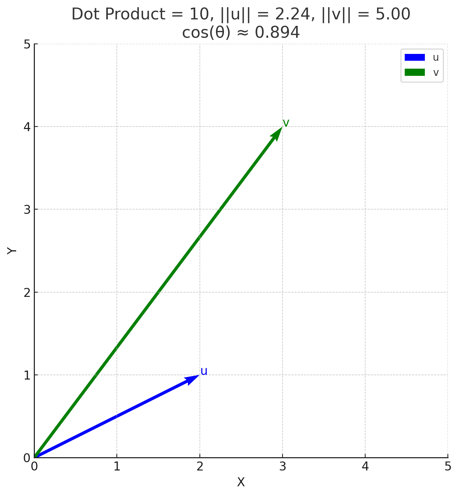
    
<i>Cosine similarity measures the angle θ between two vectors. Vectors pointing in similar directions have a cosine similarity close to 1. Orthogonal vectors have a similarity of 0. Vectors pointing in opposite directions have a similarity close to -1.</i>

### Applications

- **Text Analysis / Natural Language Processing (NLP)**: Measuring similarity between documents represented as vectors (e.g., TF-IDF vectors). Documents with similar content tend to have vectors pointing in similar directions.
- **Recommendation Systems**: Finding users or items with similar preferences based on their vector representations.
- **Information Retrieval**: Ranking documents based on their similarity to a query vector.
- **Bioinformatics**: Comparing gene expression data.

### Implementation Considerations

- Both vectors must have the same dimension.
- Handle the case where one or both vectors are zero vectors (magnitude is zero), which would lead to division by zero. Cosine similarity is typically undefined or considered 0 in this case, depending on the context.
- The complexity is dominated by the dot product and norm calculations, typically O(n) where n is the vector dimension.
